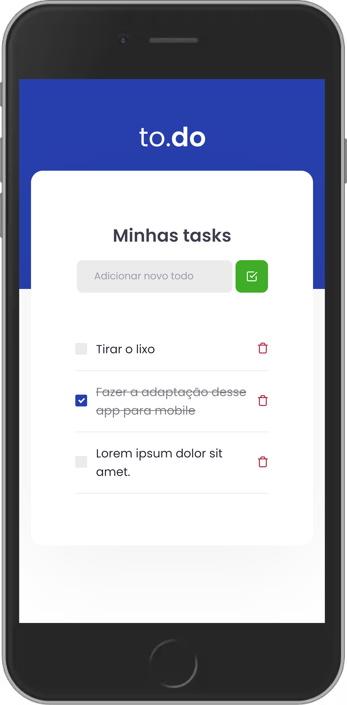

# To.do

## ℹ Descrição

Projeto desenvolvido no desafio principal do capítulo 1 do Ignite.

O desafio consistia em adicionar funcionalidades ao projeto, como adicionar tarefas, marcar como feito e remover uma tarefa.

To.do é um web app em que é possível registrar novas tarefas, apagá-las ou marcar como feitas.

## ⚒ Tecnologias

- React
- Typescript
- SASS

## ⚙ Pré-requisitos

- <a href="https://git-scm.com/" target="_blank">Git</a>
- <a href="https://yarnpkg.com/" target="_blank">Yarn</a>
- Editor de código

## 🖥 Como usar

- `git clone https://github.com/EduardoReisUX/desafio01-trilha-reactjs.git` para clonar este repositório;
- `cd desafio01-trilha-reactjs`
- `yarn install` para instalar as dependências;
- `yarn test` para verificar os testes;
- `yarn dev` para desenvolvimento;
- `yarn build` para produção.

## 👀 Espiadinha

</img>
